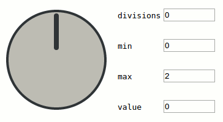

`<x-knob>` Web Component
========================

`<x-knob>` is a rotary web input component that can be controlled by dragging and rotating it (with the mouse pointer or touch input).

[Open the demo page!][demo]

[][demo]

This component has been created as a proof-of-concept, as a simple base that can be improved upon. It is a more polished version of a [previous experiment](http://codepen.io/denilsonsa/pen/LVwWJM).

Features:

* Pure JavaScript code, no libraries used.
* Customizable graphics using SVG.
* Supports mouse input.
* Supports touch input.
    * But does not support multiple fingers.
* Supports keyboard focus and input.
    * But still receives focus despite being `disabled`.
* Uses cutting-edge technology:
    * Keyboard key detection through [KeyboardEvent.key](https://developer.mozilla.org/en-US/docs/Web/API/KeyboardEvent/key), which requires [Chrome later than 45](https://code.google.com/p/chromium/issues/detail?id=227231) or Firefox 23.
    * [HTML5](http://www.html5rocks.com/) [Web Components](http://www.w3.org/wiki/WebComponents/) with [Shadow DOM](http://www.html5rocks.com/en/tutorials/webcomponents/shadowdom/) and [Custom element](http://www.html5rocks.com/en/tutorials/webcomponents/customelements/).
        * [Works](http://webcomponents.org/) on Google Chrome and Opera.
        * [Does not work](http://webcomponents.org/) on Firefox, Safari, IE, Edge.
        * Using [webcomponentsjs](https://github.com/webcomponents/webcomponentsjs/releases) as a set of polyfills and adding [`shim-shadowdom` to the CSS](https://github.com/Polymer/docs/issues/269) improves the compatibility and makes it work correctly on Firefox. Unsure about other browsers.
        * Does not require polyfills on Firefox if [`dom.webcomponents.enabled` flag](https://www.designedbyaturtle.co.uk/2015/how-to-enable-web-components-in-firefox-shadow-dom/) is enabled.
* Most likely not production-ready!
    * Unless the incompatibilities and limitations can be ignored.
    * But [TJ VanToll thinks that Web Components *Are* Ready For Production](http://developer.telerik.com/featured/web-components-ready-production/)
* Excellent example for learning the new web technologies.

How to use
----------

Open the [demo page][demo] and its [source-code](https://github.com/denilsonsa/html5-knob/blob/gh-pages/index.html). Study the demo to understand what this component is capable of.

Is it not enough? Dive into [xknob.js](https://github.com/denilsonsa/html5-knob/blob/gh-pages/xknob.js) and feel free to study how it works, and feel free to modify it to suit your needs. This repository is less like a fully packaged library and more like a starting point to let other people develop more stuff. Be sure to read [HTML5 Rocks tutorial on custom elements](http://www.html5rocks.com/en/tutorials/webcomponents/customelements/).

Limitations (AKA known bugs)
----------------------------

The current implementation is not very accessible. It would be great to apply [ARIA](https://developer.mozilla.org/en-US/docs/Web/Accessibility/ARIA) guidelines.

The current implementation does not support DOM0-style events (e.g. `xknob.oninput = function(){}` will not work). Using the modern `xknob.addEventListener('input')` works fine.

This control is not considered a [form-associated element](http://www.w3.org/TR/html5/forms.html#form-associated-element), thus its value does not get submitted. A partial solution would be to add `<input type="hidden">` as a direct children of `<x-knob>`; however, I don't know how trigger an update of XKnob whenever the `<input type="hidden">` element gets updated (i.e. how to make `form.input_name.value = 1` also update XKnob?).

The current implementation lets the element to be focused (by tab-navigation or by clicking) even if it is disabled.

Pseudo-classes such as [`:disabled`](https://drafts.csswg.org/selectors-4/#enableddisabled) do not work on this custom element. Maybe someday? is it even possible to implement that? (Note: `:focus` already works.)

For some reason, using two fingers to zoom the page will not work if one of the fingers starts the touch on the knob.

Acknowledgements
----------------

This code is loosely inspired by [KaisarCode Rotate](https://github.com/KaisarCode/Rotate).

The usage of HTML5 custom elements is based on [HTML5 Rocks tutorial](http://www.html5rocks.com/en/tutorials/webcomponents/customelements/), found through [W3C Wiki](http://www.w3.org/wiki/WebComponents/).

[Mozilla Developer Network](https://developer.mozilla.org/en-US/docs/Web/API) proved to be an extremely valuable resource.

[Web Components the Right Way](https://github.com/mateusortiz/webcomponents-the-right-way) is a very comprehensive list of resources related to Web Components.

[demo]: http://denilsonsa.github.io/html5-knob/
